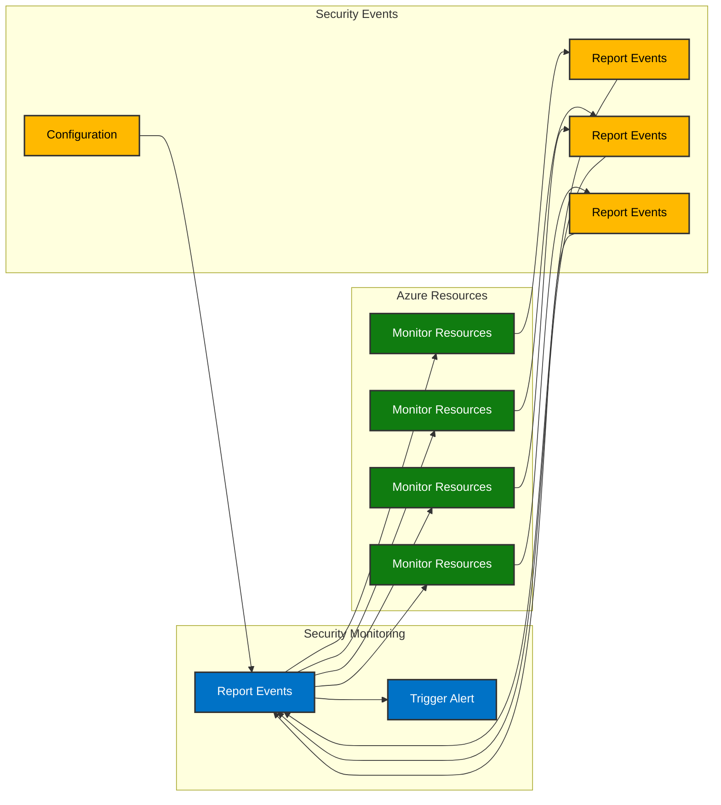

# Secure Training Implementation Design

## Overview
This document outlines the implementation design for secure machine learning training, abstracted from specific cloud providers.

## Core Components

### 1. Secure Storage Layer
- **Purpose**: Store training data and models securely
- **Requirements**:
  - Encryption at rest
  - Versioning support
  - Access control
  - Audit logging
- **Implementation**:
  - Object storage service
  - Key management service
  - Access control policies

### 2. Encryption Management
- **Purpose**: Handle data encryption/decryption
- **Requirements**:
  - Key rotation
  - Secure key storage
  - Access logging
- **Implementation**:
  - Key management service
  - Encryption/decryption service
  - Key rotation policies

### 3. Training Infrastructure
- **Purpose**: Execute training jobs securely
- **Requirements**:
  - Network isolation
  - Resource isolation
  - Secure communication
  - Confidential computing
- **Implementation**:
  - Virtual network
  - Compute resources
  - Security groups/firewalls
  - Trusted execution environment (TEE)

### 4. Access Control
- **Purpose**: Manage resource access
- **Requirements**:
  - Role-based access
  - Least privilege
  - Audit logging
- **Implementation**:
  - Identity management
  - Role definitions
  - Access policies

### 5. Confidential Computing
- **Purpose**: Protect data in use
- **Requirements**:
  - Hardware-based isolation
  - Memory encryption
  - Secure enclaves
  - Attestation
- **Implementation**:
  - TEE-enabled compute resources
  - Secure enclave management
  - Remote attestation
  - Memory encryption

## Security Measures

### 1. Data Security
- Encryption at rest
- Encryption in transit
- Secure key management
- Data access controls

### 2. Network Security
- Network isolation
- Secure communication
- Firewall rules
- DDoS protection

### 3. Access Security
- Authentication
- Authorization
- Audit logging
- Access monitoring

### 4. Compute Security
- Resource isolation
- Secure boot
- Runtime protection
- Monitoring
- Memory encryption
- Secure enclaves
- Remote attestation

### 5. Confidential Computing Security
- Hardware-based isolation
- Memory encryption
- Secure enclave protection
- Attestation verification
- Side-channel attack prevention

## Implementation Workflow

1. **Environment Setup**
   - Initialize secure storage
   - Configure encryption
   - Set up access controls
   - Verify security measures
   - Configure TEE environment
   - Set up attestation

2. **Data Preparation**
   - Encrypt training data
   - Upload to secure storage
   - Verify data integrity
   - Set access permissions
   - Prepare secure enclave data

3. **Training Configuration**
   - Configure training environment
   - Set up monitoring
   - Define security policies
   - Prepare logging
   - Configure TEE settings
   - Set up attestation verification

4. **Execution**
   - Launch training job in TEE
   - Monitor progress
   - Log activities
   - Handle errors
   - Verify attestation
   - Monitor enclave health

5. **Cleanup**
   - Secure data deletion
   - Resource cleanup
   - Audit log preservation
   - Security verification
   - Enclave termination
   - Attestation cleanup

## Monitoring and Logging

### 1. Security Monitoring
- Access attempts
- Encryption operations
- Policy violations
- Resource usage

### 2. Training Monitoring
- Job progress
- Resource utilization
- Error tracking
- Performance metrics

### 3. Audit Logging
- Access logs
- Operation logs
- Security events
- Compliance records

### 4. Confidential Computing Monitoring
- Enclave health
- Attestation status
- Memory encryption status
- Side-channel protection
- Hardware security status

## Error Handling

### 1. Security Errors
- Access violations
- Encryption failures
- Policy violations
- Resource limits

### 2. Training Errors
- Job failures
- Resource issues
- Data problems
- Network issues

### 3. Confidential Computing Errors
- Attestation failures
- Enclave initialization errors
- Memory encryption issues
- Hardware security violations
- Side-channel detection

## Compliance and Governance

### 1. Data Protection
- Data classification
- Retention policies
- Access controls
- Audit requirements

### 2. Security Standards
- Encryption standards
- Access policies
- Monitoring requirements
- Incident response

### 3. Confidential Computing Standards
- Hardware security requirements
- Attestation protocols
- Memory encryption standards
- Enclave security policies
- Side-channel protection requirements

## Implementation Considerations

### 1. Scalability
- Resource scaling
- Performance optimization
- Cost management
- Load balancing

### 2. Reliability
- Fault tolerance
- Data redundancy
- Backup strategies
- Recovery procedures

### 3. Maintainability
- Code organization
- Documentation
- Testing procedures
- Update processes

### 4. Confidential Computing Considerations
- Hardware compatibility
- Performance impact
- Cost implications
- Management overhead
- Security trade-offs

## Security Monitoring Architecture

The security monitoring system provides comprehensive protection for the confidential computing environment through continuous monitoring, alerting, and automated remediation.

## Security Monitoring Diagram

## Monitoring Components

1. **Security Monitor**
   - Real-time monitoring of all resources
   - Event collection and analysis
   - Security posture assessment

2. **Alert System**
   - Event-based alerting
   - Severity classification
   - Notification routing

3. **Remediation Service**
   - Automated issue resolution
   - Security policy enforcement
   - Configuration management

## Monitored Resources

1. **Confidential VM**
   - CPU and memory usage
   - Process monitoring
   - Security events

2. **Secure Storage**
   - Access patterns
   - Encryption status
   - Data integrity

3. **Key Vault**
   - Key usage
   - Access attempts
   - Policy compliance

4. **Network Security**
   - Traffic patterns
   - Rule effectiveness
   - Threat detection

## Security Events

1. **Authentication Events**
   - Login attempts
   - Token validation
   - Session management

2. **Access Control Events**
   - Permission changes
   - Resource access
   - Policy violations

3. **Network Events**
   - Connection attempts
   - Traffic anomalies
   - Protocol violations

4. **Configuration Events**
   - Setting changes
   - Policy updates
   - Resource modifications

## Implementation Details

1. **Monitoring System**
   - Azure Monitor integration
   - Custom metrics collection
   - Event correlation

2. **Alerting System**
   - Multi-channel notifications
   - Severity-based routing
   - Alert aggregation

3. **Remediation System**
   - Automated fixes
   - Policy enforcement
   - Configuration management

## Best Practices

1. **Monitoring**
   - Comprehensive coverage
   - Real-time analysis
   - Historical tracking

2. **Alerting**
   - Clear prioritization
   - Actionable alerts
   - Minimal false positives

3. **Remediation**
   - Automated responses
   - Safe rollback
   - Audit trail

4. **Maintenance**
   - Regular updates
   - Performance optimization
   - Capacity planning 