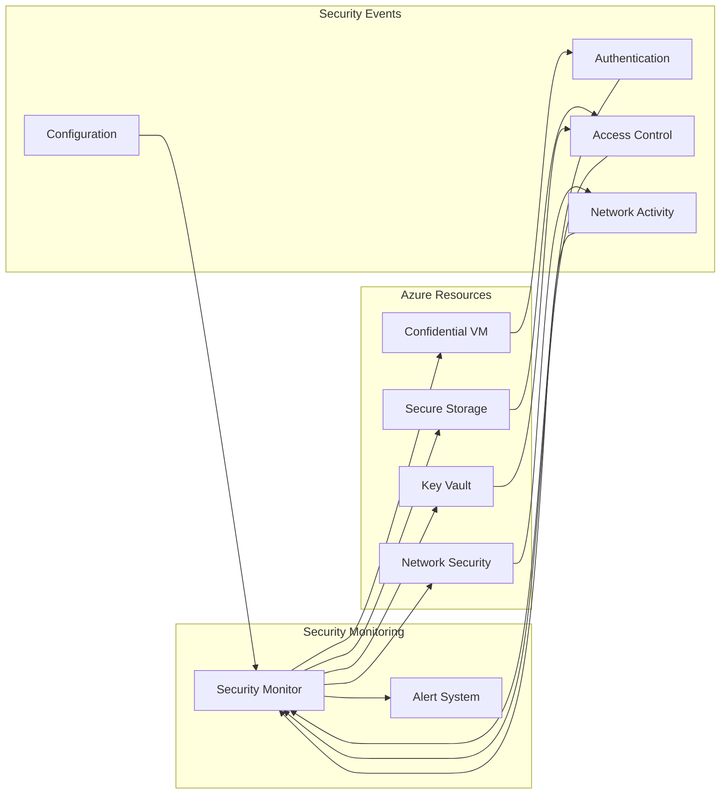

# Secure Training Implementation Design

## Overview

This document presents a comprehensive implementation design for secure machine learning training, abstracted from specific cloud providers. The design focuses on maintaining data confidentiality, integrity, and availability throughout the training process.

## Core Components

1. **Secure Storage Layer**
   - Purpose: Secure storage of training data and models
   - Requirements:
     - Encryption at rest
     - Version control
     - Access management
     - Audit logging
   - Implementation:
     - Object storage service
     - Key management service
     - Access control policies

2. **Encryption Management**
   - Purpose: Data encryption and decryption operations
   - Requirements:
     - Key rotation mechanism
     - Secure key storage
     - Access logging
   - Implementation:
     - Key management service
     - Encryption/decryption service
     - Key rotation policies

3. **Training Infrastructure**
   - Purpose: Secure training job execution
   - Requirements:
     - Network isolation
     - Resource isolation
     - Secure communication
     - Confidential computing
   - Implementation:
     - Virtual network
     - Compute resources
     - Security groups/firewalls
     - Trusted execution environment (TEE)

4. **Access Control**
   - Purpose: Resource access management
   - Requirements:
     - Role-based access control
     - Least privilege principle
     - Audit logging
   - Implementation:
     - Identity management
     - Role definitions
     - Access policies

5. **Confidential Computing**
   - Purpose: Data-in-use protection
   - Requirements:
     - Hardware-based isolation
     - Memory encryption
     - Secure enclaves
     - Remote attestation
   - Implementation:
     - TEE-enabled compute resources
     - Secure enclave management
     - Remote attestation
     - Memory encryption

## Security Measures

1. **Data Security**
   - Encryption at rest
   - Encryption in transit
   - Secure key management
   - Data access controls

2. **Network Security**
   - Network isolation
   - Secure communication protocols
   - Firewall configuration
   - DDoS protection

3. **Access Security**
   - Authentication system
   - Authorization framework
   - Audit logging
   - Access monitoring

4. **Compute Security**
   - Resource isolation
   - Secure boot
   - Runtime protection
   - Monitoring system
   - Memory encryption
   - Secure enclaves
   - Remote attestation

5. **Confidential Computing Security**
   - Hardware-based isolation
   - Memory encryption
   - Secure enclave protection
   - Attestation verification
   - Side-channel attack prevention

## Implementation Workflow

1. **Environment Setup**
   - Secure storage initialization
   - Encryption configuration
   - Access control setup
   - Security measure verification
   - TEE environment configuration
   - Attestation setup

2. **Data Preparation**
   - Training data encryption
   - Secure storage upload
   - Data integrity verification
   - Access permission configuration
   - Secure enclave data preparation

3. **Training Configuration**
   - Training environment setup
   - Monitoring system configuration
   - Security policy definition
   - Logging system setup
   - TEE configuration
   - Attestation verification setup

4. **Execution**
   - TEE-based training job launch
   - Progress monitoring
   - Activity logging
   - Error handling
   - Attestation verification
   - Enclave health monitoring

5. **Cleanup**
   - Secure data deletion
   - Resource deallocation
   - Audit log preservation
   - Security verification
   - Enclave termination
   - Attestation cleanup

## Monitoring and Logging

1. **Security Monitoring**
   - Access attempt tracking
   - Encryption operation monitoring
   - Policy violation detection
   - Resource usage tracking

2. **Training Monitoring**
   - Job progress tracking
   - Resource utilization monitoring
   - Error tracking
   - Performance metric collection

3. **Audit Logging**
   - Access log maintenance
   - Operation log management
   - Security event recording
   - Compliance documentation

4. **Confidential Computing Monitoring**
   - Enclave health monitoring
   - Attestation status tracking
   - Memory encryption status monitoring
   - Side-channel protection monitoring
   - Hardware security status tracking

## Error Handling

1. **Security Errors**
   - Access violation handling
   - Encryption failure management
   - Policy violation response
   - Resource limit management

2. **Training Errors**
   - Job failure handling
   - Resource issue resolution
   - Data problem management
   - Network issue resolution

3. **Confidential Computing Errors**
   - Attestation failure handling
   - Enclave initialization error management
   - Memory encryption issue resolution
   - Hardware security violation response
   - Side-channel attack detection

## Compliance and Governance

1. **Data Protection**
   - Data classification system
   - Retention policy implementation
   - Access control framework
   - Audit requirement fulfillment

2. **Security Standards**
   - Encryption standard compliance
   - Access policy implementation
   - Monitoring requirement fulfillment
   - Incident response protocol

3. **Confidential Computing Standards**
   - Hardware security compliance
   - Attestation protocol implementation
   - Memory encryption standard adherence
   - Enclave security policy enforcement
   - Side-channel protection implementation

## Implementation Considerations

1. **Scalability**
   - Resource scaling strategy
   - Performance optimization
   - Cost management
   - Load balancing implementation

2. **Reliability**
   - Fault tolerance implementation
   - Data redundancy strategy
   - Backup system configuration
   - Recovery procedure implementation

3. **Maintainability**
   - Code organization
   - Documentation management
   - Testing procedure implementation
   - Update process management

4. **Confidential Computing Considerations**
   - Hardware compatibility verification
   - Performance impact assessment
   - Cost analysis
   - Management overhead evaluation
   - Security trade-off analysis

## Security Monitoring Architecture

The security monitoring system provides comprehensive protection for the confidential computing environment through continuous monitoring, alerting, and automated remediation.

## Security Monitoring Diagram

The following diagram illustrates the security monitoring architecture:

## Monitoring Components

1. **Security Monitor**
   - Real-time resource monitoring
   - Event collection and analysis
   - Security posture assessment

2. **Alert System**
   - Event-based alerting
   - Severity classification
   - Notification routing

3. **Remediation Service**
   - Automated issue resolution
   - Security policy enforcement
   - Configuration management

## Monitored Resources

1. **Confidential VM**
   - CPU and memory utilization
   - Process monitoring
   - Security event tracking

2. **Secure Storage**
   - Access pattern monitoring
   - Encryption status tracking
   - Data integrity verification

3. **Key Vault**
   - Key usage monitoring
   - Access attempt tracking
   - Policy compliance verification

4. **Network Security**
   - Traffic pattern analysis
   - Rule effectiveness monitoring
   - Threat detection

## Security Events

1. **Authentication Events**
   - Login attempt monitoring
   - Token validation tracking
   - Session management monitoring

2. **Access Control Events**
   - Permission change tracking
   - Resource access monitoring
   - Policy violation detection

3. **Network Events**
   - Connection attempt monitoring
   - Traffic anomaly detection
   - Protocol violation tracking

4. **Configuration Events**
   - Setting change monitoring
   - Policy update tracking
   - Resource modification logging

## Implementation Details

1. **Monitoring System**
   - Azure Monitor integration
   - Custom metric collection
   - Event correlation

2. **Alerting System**
   - Multi-channel notification
   - Severity-based routing
   - Alert aggregation

3. **Remediation System**
   - Automated fix implementation
   - Policy enforcement
   - Configuration management

## Best Practices

1. **Monitoring**
   - Comprehensive coverage
   - Real-time analysis
   - Historical tracking

2. **Alerting**
   - Clear prioritization
   - Actionable alert generation
   - False positive minimization

3. **Remediation**
   - Automated response implementation
   - Safe rollback procedure
   - Audit trail maintenance

4. **Maintenance**
   - Regular system updates
   - Performance optimization
   - Capacity planning 