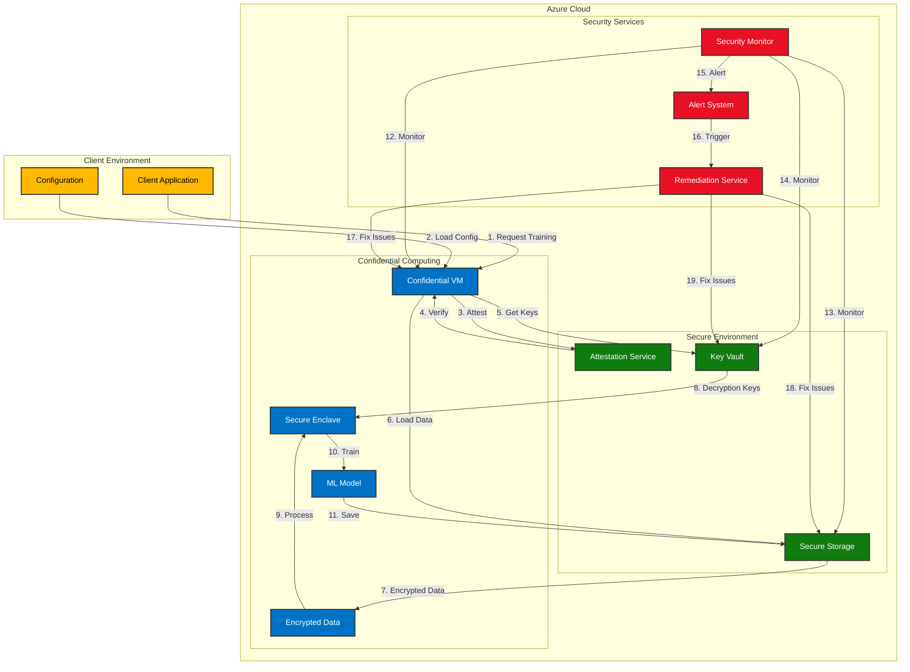

# Confidential Computing Platform - Logical Architecture

## System Overview

The confidential computing system is designed to provide secure machine learning training in the cloud. The architecture ensures data privacy and model security through multiple layers of protection.

## Architecture Diagram



## Key Components

### Client Environment
- **Client Application**: Initiates and manages training jobs
- **Configuration**: Contains settings for training and security

### Secure Environment
- **Attestation Service**: Verifies the integrity of the computing environment
- **Key Vault**: Manages encryption keys and secrets
- **Secure Storage**: Stores encrypted data and models

### Confidential Computing
- **Confidential VM**: Provides hardware-level isolation
- **Secure Enclave**: Protected memory region for sensitive operations
- **ML Model**: The machine learning model being trained
- **Encrypted Data**: Training data protected by encryption

### Security Services
- **Security Monitor**: Continuously monitors system security
- **Alert System**: Notifies of security events
- **Remediation Service**: Automatically fixes security issues

## Security Features

1. **Hardware-level Protection**
   - AMD SEV-SNP for VM isolation
   - Secure enclaves for sensitive operations

2. **Data Protection**
   - End-to-end encryption
   - Secure key management
   - Encrypted storage

3. **Access Control**
   - Role-based access control (RBAC)
   - Network security rules
   - Authentication and authorization

4. **Monitoring and Remediation**
   - Real-time security monitoring
   - Automated alerting
   - Automatic remediation of security issues

## Integration Points

1. **Client Integration**
   - REST API for job management
   - Secure configuration management
   - Status monitoring

2. **Azure Services Integration**
   - Azure Key Vault for key management
   - Azure Storage for data storage
   - Azure Monitor for security monitoring

3. **Security Integration**
   - Azure Security Center
   - Azure Sentinel
   - Custom security monitoring

## Deployment Considerations

1. **Resource Requirements**
   - Confidential computing capable VMs
   - Sufficient storage for encrypted data
   - Network bandwidth for secure communication

2. **Security Requirements**
   - Azure AD integration
   - Network security groups
   - Key rotation policies

3. **Monitoring Requirements**
   - Security event logging
   - Performance monitoring
   - Resource utilization tracking

## 1. High-Level Architecture Overview

### 1.1 Core Principles
- Platform-agnostic design
- Modular and extensible components
- Zero-trust security model
- Privacy-preserving computation
- Multi-party collaboration support

### 1.2 Logical Components
```
┌─────────────────────────────────────────────────────────────┐
│                    Client Layer                             │
│  ┌─────────────┐  ┌─────────────┐  ┌─────────────────────┐  │
│  │ Web Client  │  │ API Client  │  │ Management Console  │  │
│  └─────────────┘  └─────────────┘  └─────────────────────┘  │
└───────────────────────────┬─────────────────────────────────┘
                            │
┌───────────────────────────▼─────────────────────────────────┐
│                    API Gateway Layer                        │
│  ┌─────────────┐  ┌─────────────┐  ┌─────────────────────┐  │
│  │ Auth/API    │  │ Rate        │  │ Request             │  │
│  │ Gateway     │  │ Limiting    │  │ Routing             │  │
│  └─────────────┘  └─────────────┘  └─────────────────────┘  │
└───────────────────────────┬─────────────────────────────────┘
                            │
┌───────────────────────────▼─────────────────────────────────┐
│                    Security Layer                           │
│  ┌─────────────┐  ┌─────────────┐  ┌─────────────────────┐  │
│  │ Identity    │  │ Access      │  │ Encryption          │  │
│  │ Management  │  │ Control     │  │ Services            │  │
│  └─────────────┘  └─────────────┘  └─────────────────────┘  │
└───────────────────────────┬─────────────────────────────────┘
                            │
┌───────────────────────────▼─────────────────────────────────┐
│                    Confidential Computing Layer             │
│  ┌─────────────┐  ┌─────────────┐  ┌─────────────────────┐  │
│  │ Secure      │  │ Privacy-    │  │ Multi-Party         │  │
│  │ Enclaves    │  │ Preserving  │  │ Computation         │  │
│  └─────────────┘  │ Computing   │  └─────────────────────┘  │
│                   └─────────────┘                           │
└───────────────────────────┬─────────────────────────────────┘
                            │
┌───────────────────────────▼─────────────────────────────────┐
│                    Data Layer                               │
│  ┌─────────────┐  ┌─────────────┐  ┌─────────────────────┐  │
│  │ Secure      │  │ Metadata    │  │ Audit               │  │
│  │ Storage     │  │ Management  │  │ Logging             │  │
│  └─────────────┘  └─────────────┘  └─────────────────────┘  │
└─────────────────────────────────────────────────────────────┘
```

## 2. Component Details

### 2.1 Client Layer
- **Web Client**: Browser-based interface for user interaction
- **API Client**: Programmatic access for integration
- **Management Console**: Administrative interface for platform management

### 2.2 API Gateway Layer
- **Authentication Gateway**: Handles identity verification and token management
- **Rate Limiting**: Controls request throughput and prevents abuse
- **Request Routing**: Directs requests to appropriate services

### 2.3 Security Layer
- **Identity Management**
  - User authentication
  - Multi-factor authentication
  - Identity federation
  - Role-based access control

- **Access Control**
  - Policy enforcement
  - Permission management
  - Session control
  - Resource access validation

- **Encryption Services**
  - Key management
  - Data encryption/decryption
  - Certificate management
  - Secure key exchange

### 2.4 Confidential Computing Layer
- **Secure Enclaves**
  - Trusted Execution Environment (TEE)
  - Memory encryption
  - Secure boot process
  - Remote attestation

- **Privacy-Preserving Computing**
  - Homomorphic encryption
  - Secure multi-party computation
  - Federated learning
  - Differential privacy

- **Multi-Party Computation**
  - Secure aggregation
  - Privacy-preserving analytics
  - Collaborative computation
  - Data sharing protocols

### 2.5 Data Layer
- **Secure Storage**
  - Encrypted data storage
  - Data partitioning
  - Backup and recovery
  - Data lifecycle management

- **Metadata Management**
  - Data catalog
  - Schema management
  - Data lineage
  - Version control

- **Audit Logging**
  - Activity tracking
  - Compliance logging
  - Security event logging
  - Performance monitoring

## 3. Cross-Cutting Concerns

### 3.1 Security
- End-to-end encryption
- Zero-trust architecture
- Secure communication channels
- Threat detection and prevention

### 3.2 Compliance
- Data sovereignty
- Privacy regulations
- Industry standards
- Audit requirements

### 3.3 Monitoring
- Performance metrics
- Security monitoring
- Resource utilization
- Compliance tracking

### 3.4 Operations
- Deployment automation
- Configuration management
- Backup and recovery
- Incident response

## 4. Integration Points

### 4.1 External Systems
- Identity providers
- Data sources
- Analytics platforms
- Monitoring systems

### 4.2 Internal Services
- Authentication services
- Encryption services
- Storage services
- Compute services

## 5. Implementation Considerations

### 5.1 Cloud Provider Implementation
- **AWS Implementation**
  - Nitro Enclaves
  - AWS KMS
  - AWS IAM
  - AWS CloudHSM

- **Azure Implementation**
  - Azure Confidential Computing
  - Azure Key Vault
  - Azure AD
  - Azure HSM

- **GCP Implementation**
  - Confidential VMs
  - Cloud KMS
  - IAM
  - Cloud HSM

- **OCI Implementation**
  - OCI Confidential Computing
  - OCI Vault
  - OCI Identity and Access Management
  - OCI Cloud Guard
  - OCI Security Zones
  - OCI Data Safe
  - OCI Key Management Service
  - OCI Security Advisor

### 5.2 Hybrid Deployment
- Multi-cloud support
- On-premises integration
- Edge computing support
- Cross-cloud data sharing

### 5.3 Scalability
- Horizontal scaling
- Load balancing
- Resource optimization
- Performance tuning

## 6. Security Controls

### 6.1 Data Protection
- Data encryption at rest
- Data encryption in transit
- Secure key management
- Data access controls

### 6.2 Access Management
- Role-based access control
- Least privilege principle
- Session management
- Access monitoring

### 6.3 Compliance
- Data residency
- Privacy regulations
- Industry standards
- Audit requirements 