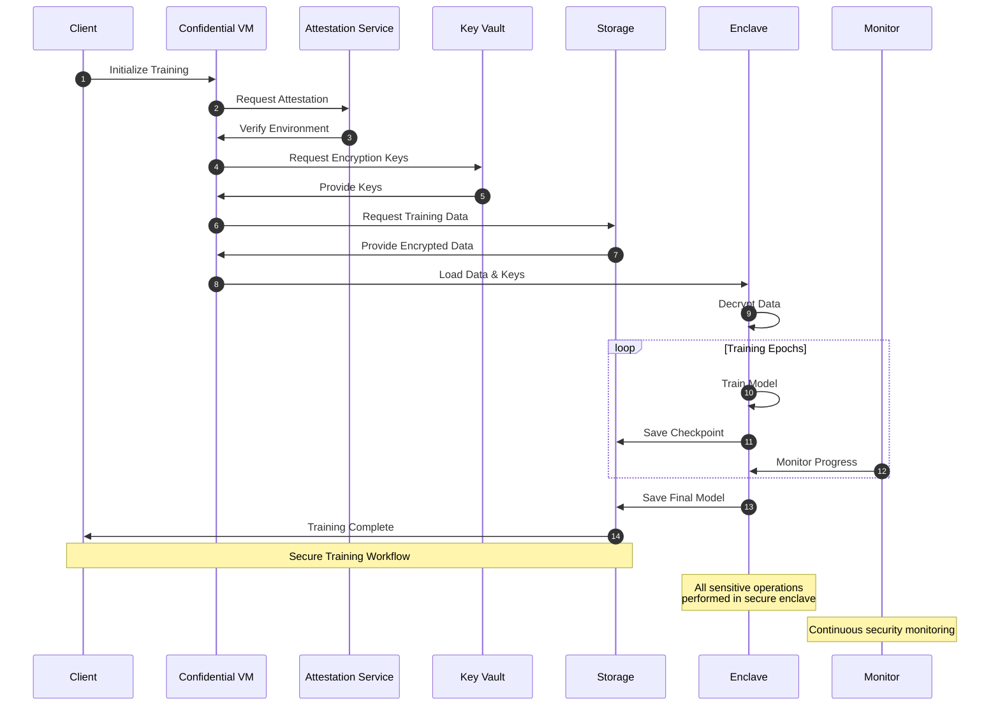

# Secure Training Workflow

## Overview

The secure training workflow implements a comprehensive approach to machine learning model training within a confidential computing environment, ensuring robust security controls and continuous monitoring throughout the process.

## Training Workflow Diagram

The following sequence diagram illustrates the secure training workflow:

## Workflow Stages

### 1. Environment Preparation

#### 1.1 Infrastructure Setup
- Secure storage initialization
- Encryption key configuration
- Network isolation setup
- Access control establishment
- Trusted Execution Environment (TEE) configuration
- Hardware security implementation

#### 1.2 Security Configuration
- Encryption policy implementation
- Access policy configuration
- Monitoring system deployment
- Logging infrastructure setup
- Attestation service configuration
- Memory encryption implementation

#### 1.3 Resource Allocation
- Compute resource provisioning
- Storage system configuration
- Network infrastructure setup
- Monitoring system deployment
- TEE resource allocation
- Secure enclave configuration

### 2. Data Management

#### 2.1 Data Preparation
- Data validation and sanitization
- Data encryption implementation
- Secure data upload
- Access control configuration
- Enclave data preparation
- Secure memory configuration

#### 2.2 Data Security
- Encryption verification
- Access control validation
- Data integrity verification
- Backup system configuration
- Enclave data protection
- Memory encryption validation

### 3. Training Process

#### 3.1 Job Configuration
- Model architecture configuration
- Hyperparameter optimization
- Resource allocation strategy
- Security policy implementation
- TEE configuration
- Attestation protocol setup

#### 3.2 Execution
- TEE-based job execution
- Progress monitoring
- Error handling implementation
- Resource utilization tracking
- Attestation verification
- Enclave health monitoring

#### 3.3 Model Management
- Model version control
- Model encryption implementation
- Access control management
- Storage system optimization
- Secure model export
- Enclave resource cleanup

### 4. Monitoring and Logging

#### 4.1 Security Monitoring
- Access pattern monitoring
- Encryption operation tracking
- Policy compliance verification
- Threat detection implementation
- Enclave security monitoring
- Attestation status tracking

#### 4.2 Training Monitoring
- Progress tracking
- Resource utilization monitoring
- Performance metric collection
- Error tracking and analysis
- TEE performance monitoring
- Memory encryption status tracking

#### 4.3 Audit Logging
- Access log maintenance
- Operation log management
- Security event recording
- Compliance documentation
- Attestation log management
- Enclave event tracking

### 5. Cleanup and Maintenance

#### 5.1 Resource Cleanup
- Job termination protocol
- Resource deallocation
- Data sanitization
- Log preservation
- Enclave termination
- TEE cleanup

#### 5.2 Security Verification
- Access control audit
- Encryption verification
- Policy compliance check
- Audit log review
- Attestation verification
- Hardware security validation

## Security Controls

### 1. Data Protection
- Encryption at rest
- Encryption in transit
- Access control implementation
- Data integrity verification

### 2. Access Control
- Authentication system
- Authorization framework
- Role-based access control
- Policy enforcement

### 3. Network Security
- Network isolation
- Secure communication protocols
- Firewall configuration
- DDoS protection

### 4. Monitoring
- Security monitoring system
- Performance monitoring
- Compliance monitoring
- Audit logging

### 5. Confidential Computing Controls
- Hardware-based isolation
- Memory encryption
- Secure enclave implementation
- Remote attestation
- Side-channel protection
- Hardware security measures

## Error Handling

### 1. Security Errors
- Access violation handling
- Encryption failure management
- Policy violation response
- Resource limit management

### 2. Training Errors
- Job failure handling
- Resource issue resolution
- Data problem management
- Network issue resolution

### 3. Confidential Computing Errors
- Attestation failure handling
- Enclave error management
- Memory encryption issue resolution
- Hardware security violation response
- Side-channel attack detection
- TEE initialization failure handling

## Best Practices

### 1. Security
- Regular key rotation
- Access control review
- Policy updates
- Security audit implementation

### 2. Performance
- Resource optimization
- Cost management
- Load balancing
- Scaling strategy implementation

### 3. Maintenance
- Regular system updates
- Security patch management
- Performance tuning
- Documentation maintenance

### 4. Confidential Computing
- Regular attestation verification
- Enclave health monitoring
- Memory encryption validation
- Hardware security updates
- Side-channel protection
- TEE optimization

## Compliance Requirements

### 1. Data Protection
- Data classification system
- Retention policy implementation
- Access control framework
- Audit requirement fulfillment

### 2. Security Standards
- Encryption standard compliance
- Access policy implementation
- Monitoring requirement fulfillment
- Incident response protocol

### 3. Confidential Computing Standards
- Hardware security compliance
- Attestation protocol implementation
- Memory encryption standard adherence
- Enclave security policy enforcement
- Side-channel protection implementation
- TEE compliance verification

## Implementation Guidelines

### 1. Setup
- Security checklist implementation
- Configuration verification
- Access control testing
- Encryption validation

### 2. Execution
- Progress monitoring
- Resource tracking
- Error handling
- Log maintenance

### 3. Cleanup
- Secure termination protocol
- Resource cleanup
- Log preservation
- Security verification

### 4. Confidential Computing
- Hardware compatibility verification
- TEE configuration
- Attestation setup
- Memory encryption implementation
- Enclave management
- Security verification 