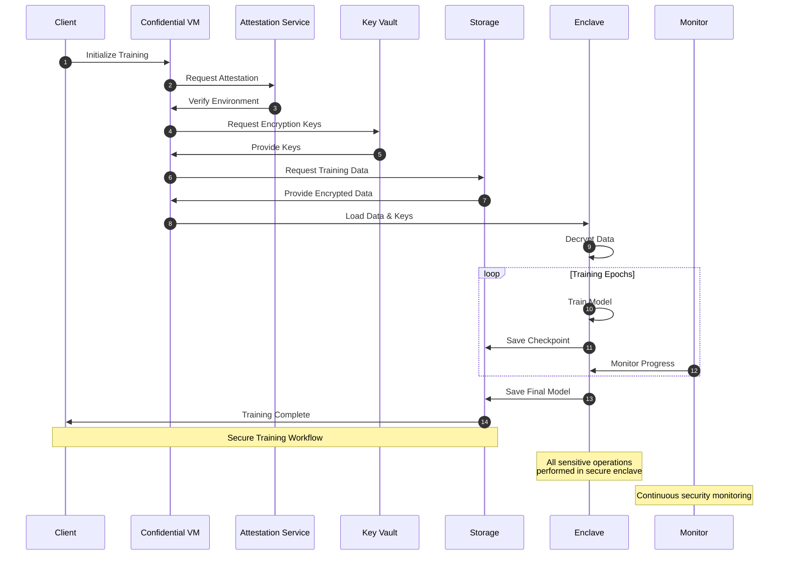

# Secure Training Workflow

## Overview

The secure training workflow ensures that machine learning model training is performed in a confidential computing environment with proper security controls and monitoring.

## Training Workflow Diagram

The following diagram illustrates the secure training workflow:

The workflow consists of the following steps:

## Workflow Steps

1. **Initialization**
   - Client initiates training job
   - Configuration is loaded
   - Environment is prepared

2. **Environment Verification**
   - Attestation request is made
   - Environment integrity is verified
   - Security posture is validated

3. **Resource Access**
   - Encryption keys are retrieved
   - Training data is loaded
   - Secure environment is established

4. **Training Process**
   - Data is decrypted in secure enclave
   - Model training is performed
   - Checkpoints are saved securely

5. **Monitoring and Security**
   - Progress is monitored
   - Security events are tracked
   - Alerts are generated if needed

6. **Completion**
   - Final model is saved
   - Resources are cleaned up
   - Results are returned to client

## Security Considerations

1. **Data Protection**
   - All data is encrypted at rest
   - Data is only decrypted in secure enclave
   - Keys are managed by Key Vault

2. **Environment Security**
   - Hardware-level isolation
   - Secure enclave protection
   - Network security controls

3. **Access Control**
   - Role-based access
   - Least privilege principle
   - Secure authentication

4. **Monitoring**
   - Real-time security monitoring
   - Performance tracking
   - Resource utilization

## Implementation Details

1. **Client Side**
   - Secure configuration management
   - Job status monitoring
   - Result retrieval

2. **Server Side**
   - Secure environment setup
   - Resource management
   - Security enforcement

3. **Storage**
   - Encrypted data storage
   - Secure checkpointing
   - Model versioning

4. **Monitoring**
   - Security event logging
   - Performance metrics
   - Resource tracking

## Best Practices

1. **Security**
   - Regular key rotation
   - Security updates
   - Access review

2. **Performance**
   - Resource optimization
   - Batch processing
   - Caching strategies

3. **Monitoring**
   - Regular health checks
   - Performance monitoring
   - Security scanning

4. **Maintenance**
   - Regular updates
   - Backup procedures
   - Disaster recovery

## Workflow Stages

### 1. Environment Preparation

#### 1.1 Infrastructure Setup
- Initialize secure storage
- Configure encryption keys
- Set up network isolation
- Establish access controls
- Configure TEE environment
- Set up hardware security

#### 1.2 Security Configuration
- Configure encryption policies
- Set up access policies
- Enable monitoring
- Configure logging
- Set up attestation
- Configure memory encryption

#### 1.3 Resource Allocation
- Allocate compute resources
- Configure storage
- Set up networking
- Enable monitoring
- Provision TEE resources
- Configure secure enclaves

### 2. Data Management

#### 2.1 Data Preparation
- Data validation
- Data encryption
- Data upload
- Access control setup
- Prepare enclave data
- Configure secure memory

#### 2.2 Data Security
- Encryption verification
- Access control verification
- Data integrity checks
- Backup configuration
- Enclave data protection
- Memory encryption verification

### 3. Training Process

#### 3.1 Job Configuration
- Model configuration
- Hyperparameter setup
- Resource allocation
- Security settings
- TEE configuration
- Attestation setup

#### 3.2 Execution
- Job submission in TEE
- Progress monitoring
- Error handling
- Resource monitoring
- Attestation verification
- Enclave health monitoring

#### 3.3 Model Management
- Model versioning
- Model encryption
- Access control
- Storage management
- Secure model export
- Enclave cleanup

### 4. Monitoring and Logging

#### 4.1 Security Monitoring
- Access monitoring
- Encryption monitoring
- Policy compliance
- Threat detection
- Enclave monitoring
- Attestation status

#### 4.2 Training Monitoring
- Progress tracking
- Resource utilization
- Performance metrics
- Error tracking
- TEE performance
- Memory encryption status

#### 4.3 Audit Logging
- Access logs
- Operation logs
- Security events
- Compliance records
- Attestation logs
- Enclave events

### 5. Cleanup and Maintenance

#### 5.1 Resource Cleanup
- Job termination
- Resource release
- Data cleanup
- Log preservation
- Enclave termination
- TEE cleanup

#### 5.2 Security Verification
- Access review
- Encryption verification
- Policy compliance
- Audit review
- Attestation verification
- Hardware security check

## Security Controls

### 1. Data Protection
- Encryption at rest
- Encryption in transit
- Access controls
- Data integrity

### 2. Access Control
- Authentication
- Authorization
- Role management
- Policy enforcement

### 3. Network Security
- Network isolation
- Secure communication
- Firewall rules
- DDoS protection

### 4. Monitoring
- Security monitoring
- Performance monitoring
- Compliance monitoring
- Audit logging

### 5. Confidential Computing Controls
- Hardware-based isolation
- Memory encryption
- Secure enclaves
- Remote attestation
- Side-channel protection
- Hardware security

## Error Handling

### 1. Security Errors
- Access violations
- Encryption failures
- Policy violations
- Resource limits

### 2. Training Errors
- Job failures
- Resource issues
- Data problems
- Network issues

### 3. Confidential Computing Errors
- Attestation failures
- Enclave errors
- Memory encryption issues
- Hardware security violations
- Side-channel attacks
- TEE initialization failures

## Best Practices

### 1. Security
- Regular key rotation
- Access review
- Policy updates
- Security audits

### 2. Performance
- Resource optimization
- Cost management
- Load balancing
- Scaling strategies

### 3. Maintenance
- Regular updates
- Security patches
- Performance tuning
- Documentation updates

### 4. Confidential Computing
- Regular attestation
- Enclave health checks
- Memory encryption verification
- Hardware security updates
- Side-channel protection
- TEE optimization

## Compliance Requirements

### 1. Data Protection
- Data classification
- Retention policies
- Access controls
- Audit requirements

### 2. Security Standards
- Encryption standards
- Access policies
- Monitoring requirements
- Incident response

### 3. Confidential Computing Standards
- Hardware security requirements
- Attestation protocols
- Memory encryption standards
- Enclave security policies
- Side-channel protection
- TEE compliance

## Implementation Guidelines

### 1. Setup
- Follow security checklist
- Verify configurations
- Test access controls
- Validate encryption

### 2. Execution
- Monitor progress
- Track resources
- Handle errors
- Maintain logs

### 3. Cleanup
- Secure termination
- Resource cleanup
- Log preservation
- Security verification

### 4. Confidential Computing
- Hardware compatibility check
- TEE configuration
- Attestation setup
- Memory encryption
- Enclave management
- Security verification 